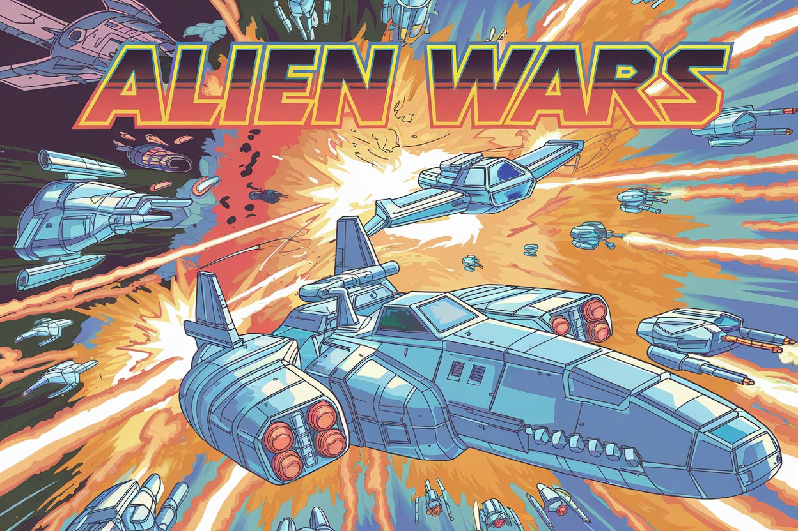
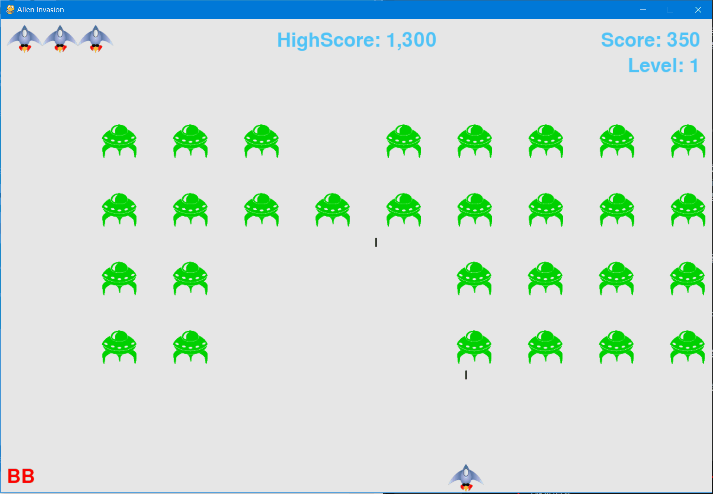

# Python打飞机游戏

这是一个基于《Python编程：从入门到实践》一书中的Pygame编程练习开发的打飞机游戏。在原有基础上增加了一些新功能，包括：
- 增加射击和爆炸音效；
- 增加炸弹功能，投放炸弹会消灭全屏敌人；
- 增加游戏启动画面；
- 增加游戏按键说明；

## 项目特点

- 使用Pygame库开发
- 完整的游戏逻辑和界面
- 添加了音效
- 适合Python初学者学习和参考

## 如何开始

1. 确保已安装Python和Pygame库
2. 克隆或下载本仓库
3. 运行以下命令启动游戏:
python alien_invasion.py

## 游戏控制

- 空格键: 发射子弹
- 箭头键: 左右移动飞船
- Alt键: 投放炸弹消灭全屏敌人

## 项目结构

- alien_invasion.py: 主程序文件
- settings.py: 游戏设置
- game_stats.py: 游戏统计信息
- scoreboard.py: 得分显示
- button.py: 按钮类
- ship.py: 飞船类
- alien.py: 外星人类
- bullet.py: 子弹类
- game_functions.py: 游戏功能函数

## 游戏截图

## 致谢

- 《Python编程：从入门到实践》作者
- 网络上的游戏素材提供者
- 游戏启动画面使用[Ideogram](https://ideogram.ai/t/explore)绘制
